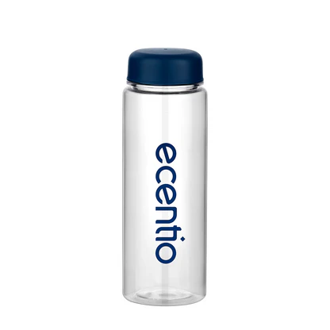

# PerancanganWeb-DesainGrafis-BisDig

1. Promo_Card

Prototipe Desain,
Membuat prototipe desain sebelum implementasi membantu memvisualisasikan ide secara nyata, memvalidasi konsep dengan stakeholder, dan mengidentifikasi masalah lebih awal sehingga pengembangan lebih efisien dengan revisi minimal.

Promo Card,
Promo Card adalah komponen UI yang menampilkan penawaran khusus (seperti diskon atau event) dalam bentuk kartu visual yang terdiri dari gambar, judul, deskripsi, dan tombol aksi (CTA) untuk meningkatkan engagement pengguna.

[PromoCard](https://github.com/ILLAN-235/PerancanganWeb-DesainGrafis-BisDig/blob/Koding/Promo_Card)

2. Tampilan_Komentar

Menambahkan Interaktivitas Sederhana dengan JavaScript pada Promo Card
JavaScript dapat digunakan untuk membuat komponen Promo Card lebih interaktif, seperti:

Menambahkan efek ketika tombol diklik,contohnya alert, redirect, atau animasi.

Mengubah tampilan dinamis, contohnya hitung mundur promo.

Berinteraksi dengan API, contohnya mengecek ketersediaan promo.

[Tampilkan_Komentar](https://github.com/ILLAN-235/PerancanganWeb-DesainGrafis-BisDig/blob/Koding/Tampilkan_Komentar)

3. Responsive_Portfolio
   
- Konsep Responsive Design
  
Responsive Design adalah pendekatan desain web yang membuat tampilan situs menyesuaikan otomatis dengan ukuran layar perangkat (desktop, tablet, mobile). Tujuannya:

- Memastikan konten mudah dibaca dan diakses di semua device.

- Meningkatkan pengalaman pengguna (UX) dan SEO.

 Mengurangi kebutuhan membuat versi terpisah untuk mobile/desktop.

 [Responsive_Portofolio](https://github.com/ILLAN-235/PerancanganWeb-DesainGrafis-BisDig/blob/Koding/ResponsivePortfolio/Portofolio.css)

 4. Homepage

    1. Hierarki Visual
Prinsip ini mengatur elemen desain berdasarkan tingkat kepentingannya, sehingga pengguna dapat memahami informasi dengan cepat dan alami.

Penerapan dalam UI/UX:

Ukuran & Skala: Elemen penting (seperti judul atau tombol CTA) dibuat lebih besar untuk menarik perhatian.

Warna & Kontras: Warna cerah atau kontras tinggi digunakan untuk elemen utama (misal: tombol "Beli Sekarang").

Typography: Penggunaan font tebal (bold) untuk heading dan font reguler untuk teks pendukung.

Penempatan: Konten utama diletakkan di area yang mudah terlihat (misal: atas halaman atau bagian tengah).

Contoh: Pada landing page, judul produk lebih besar daripada deskripsi, dan tombol CTA berwarna mencolok.

2. Kontras (Contrast)
Kontras membantu membedakan elemen dan meningkatkan keterbacaan serta aksesibilitas.

Penerapan dalam UI/UX:

Warna: Tombol utama menggunakan warna yang kontras dengan latar belakang (misal: oranye pada biru).

Teks: Teks hitam di atas putih lebih mudah dibaca daripada abu-abu muda.

Shape & Ukuran: Kontras bentuk (misal: tombol bulat di antara kotak) membuat elemen menonjol.

Contoh: Aplikasi kesehatan menggunakan warna merah untuk notifikasi darurat agar mudah terlihat.

3. Whitespace (Negative Space)
Ruang kosong di sekitar elemen membantu mengurangi kepadatan dan meningkatkan fokus pengguna.

Penerapan dalam UI/UX:

Klaritas: Memberi jarak antar paragraf atau gambar agar konten tidak terlihat berantakan.

Fokus: Whitespace mengarahkan mata pengguna ke elemen kunci (misal: formulir pendaftaran).

Kenyamanan: Desain minimalis dengan ruang lega terasa lebih profesional dan modern.

Contoh: Situs Apple menggunakan whitespace luas di sekitar produk untuk menciptakan kesan premium.

4. Konsistensi (Consistency)
Konsistensi dalam desain mengurangi kebingungan pengguna dan meningkatkan kemudahan navigasi.

Penerapan dalam UI/UX:

Warna & Font: Palette warna dan font seragam di seluruh halaman.

Pola Interaksi: Tombol dengan fungsi sama memiliki bentuk dan warna yang sama.

Navigasi: Menu selalu berada di posisi yang konsisten (misal: header atau sidebar).

Contoh: Aplikasi seperti Spotify menggunakan warna hijau dan layout konsisten di semua halaman.

5. Prinsip UX: User-Centered Design
Desain harus berfokus pada kebutuhan pengguna, bukan hanya estetika.

Penerapan:

Usability Testing: Menguji desain dengan pengguna nyata untuk identifikasi masalah.

Feedback: Menyediakan tombol "Bantuan" atau chat support untuk interaksi.

Aksesibilitas: Memastikan kontras warna cukup untuk pengguna tunanetra.

Contoh: Google menyederhanakan tampilan pencarian untuk memprioritaskan kecepatan dan kemudahan.

Kombinasi Prinsip untuk Pengalaman Optimal
Sebagai contoh, sebuah e-commerce dapat menggunakan:

Hierarki visual: Harga diskon ditampilkan lebih besar daripada harga asli.

Kontras: Tombol "Checkout" berwarna hijau cerah di atas latar putih.

Whitespace: Ruang antar produk agar tidak terlalu padat.

Konsistensi: Ikon keranjang belanja sama di seluruh halaman.

--

5. Profil

1. Kerangka Dasar HTML5

- <!DOCTYPE html>: Deklarasi tipe dokumen sebagai HTML5.

- <html>: Elemen root yang membungkus seluruh konten.

- <head>: Berisi metadata seperti judul halaman (<title>), deskripsi SEO, dan link ke CSS.

- <body>: Tempat semua konten yang terlihat oleh pengguna.

2. Komponen Halaman Profil

A. Header (Bagian Atas)

Foto Profil:

- Gambar lingkaran (dibuat dengan CSS border-radius)

- Ukuran proporsional (misal: 200x200px)

- Efek bayangan (box-shadow) untuk kedalaman visual

Nama Fotografer:

- Heading besar (<h1>) sebagai fokus utama (prinsip hierarki visual)

Tagline:

- Teks pendek di bawah nama (misal: "Fotografer Pernikahan Profesional")

- Warna lebih soft untuk kontras yang seimbang

B. Deskripsi (Bio)

Paragraf Pengantar:

- Teks singkat tentang spesialisasi dan pengalaman

- Jarak antar baris (line-height) yang nyaman dibaca

Penataan Layout:

- Lebar teks dibatasi (misal: 800px) untuk keterbacaan

- Posisi ditengah (text-align: center) untuk fokus

C. Tautan Media Sosial

- Ikon Sosial Media:

- Tombol bulat dengan warna khas platform (Instagram: merah muda, Twitter: biru)

- Efek hover (sedikit naik saat kursor mendekat) untuk interaktivitas

Aksesibilitas:

- Label tersembunyi (aria-label) untuk pembaca layar

D. Galeri Contoh Karya

Grid Foto:

- Tampilan grid responsif (3-4 kolom di desktop, 1 kolom di mobile)

- Rasio gambar konsisten (misal: 1:1 atau 4:3)

- Efek zoom halus saat dihover

E. Footer (Bagian Bawah)

- Informasi Kontak:

- Email/nomor telepon

- Hak cipta sederhana

3. Prinsip UI/UX yang Diterapkan
Hierarki Visual:

- Nama > Tagline > Bio > Galeri (ukuran font menurun sesuai pentingnya).

Kontras:

- Warna teks gelap di atas background terang.

- Tombol media sosial mencolok dengan warna brand.

Whitespace:

- Jarak antar section cukup longgar (40-60px).

- Padding di sekitar teks untuk pernapasan visual.

Konsistensi:

- Warna primer/secondary yang seragam.

- Gaya tombol dan font sama di seluruh halaman.

4. Alur Pengalaman Pengguna

- Pengguna langsung melihat foto profil dan nama.

- Tagline memberi konteks cepat tentang spesialisasi.

- Bio menjelaskan kredensial secara ringkas.

- Tautan sosial media mudah ditemukan (posisi strategis).

- Galeri menunjukkan bukti karya (visual > teks).

