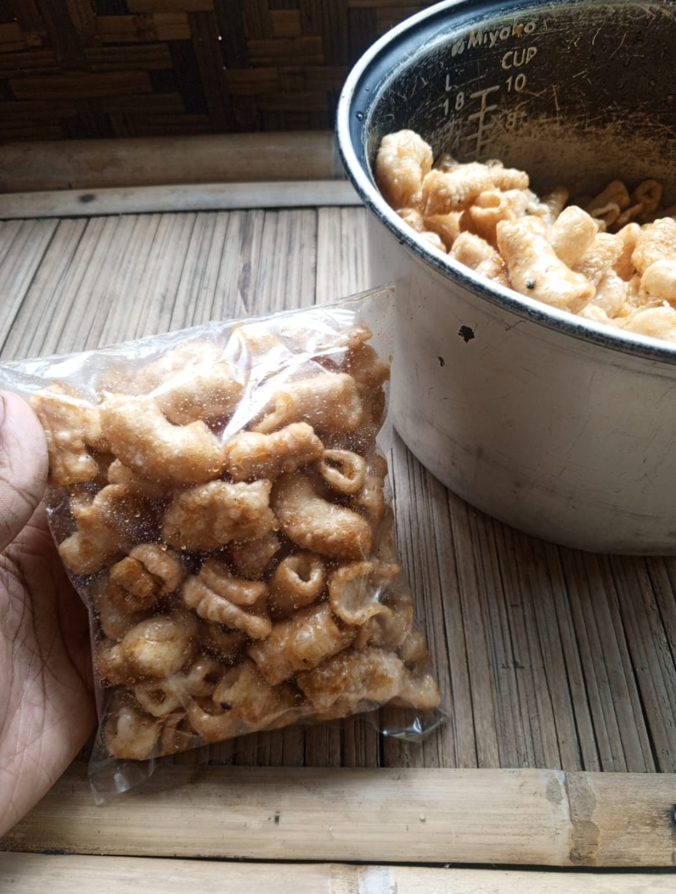

# PerancanganWeb-DesainGrafis-BisDig

1. Promo_Card

Prototipe Desain,
Membuat prototipe desain sebelum implementasi membantu memvisualisasikan ide secara nyata, memvalidasi konsep dengan stakeholder, dan mengidentifikasi masalah lebih awal sehingga pengembangan lebih efisien dengan revisi minimal.

Promo Card,
Promo Card adalah komponen UI yang menampilkan penawaran khusus (seperti diskon atau event) dalam bentuk kartu visual yang terdiri dari gambar, judul, deskripsi, dan tombol aksi (CTA) untuk meningkatkan engagement pengguna.

https://github.com/ILLAN-235/PerancanganWeb-DesainGrafis-BisDig/blob/47207e810dbbf7608a1900a334f23fc82d202eed/Promo_Card
